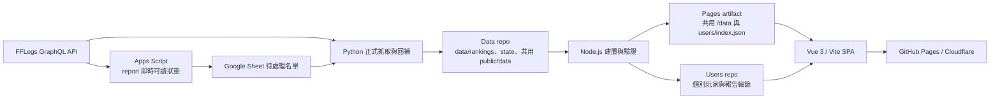

# 系統架構

本專案採靜態化分離架構：Python 保存可追溯的 FFLogs 來源脈絡，Node.js 建置前端可直接讀取的統計 JSON，Vue 只處理呈現與使用者端篩選。高頻來源資料與個別玩家 JSON 分散到專用 repo，主站 Pages artifact 只保留共用資料與玩家搜尋索引。

逐檔責任見 [codebase-map.md](codebase-map.md)，使用者功能見 [features.md](features.md)，JSON 格式與歷史保護見 [data-contracts.md](data-contracts.md)。

## 資料流



### Repo 分工

| Repo／產物 | 保存內容 | 不保存內容 |
| --- | --- | --- |
| 主 repo | 程式碼、設定、文件、靜態 icon／圖片與 workflow。 | `data/`、`public/data/`、本機快取、OAuth 憑證。 |
| Data repo | 權威 `data/`、共用 `public/data/` 根層 JSON、`public/data/fun/` 與 manifest。 | 可重建薄索引、hidden delta、個別玩家檔、報告細節。 |
| Users repo | 最新個別玩家主檔、使用者報告細節與 hidden 使用者差量。 | 歷史版本；每輪收斂為單一 root snapshot。 |
| Pages artifact | 前端 bundle、共用資料、`data/users/index.json`、低基數 SEO／OG 頁。 | 個別玩家 JSON、逐玩家靜態頁與玩家 OG 圖。 |

Data repo 的 report／fight／player／checkpoint 是 append-only 歷史資產。root snapshot 會替換 repo Git 歷史以控制容量，但發布工具會先比較前後 manifest 與資料身分，不能因快照收斂而遺失內容。

## Data Fetching Layer

`scripts/fetch_fflogs.py` 是正式排行榜掃描的唯一入口，負責：

- 讀取單組或多組 OAuth Client Credentials。
- 滑動視窗限流、憑證輪替、429 冷卻、暫時性 HTTP／連線錯誤重試與執行時間預算。
- 近期、延遲、歷史 reports 掃描，以及既有 report 公開狀態巡檢。
- 查完整 fight list 並依 fight 層 encounter／difficulty 分派 mixed report。
- 以 `masterData.actors(type: "Player")` 與 `playerDetails` 判斷繁中服玩家。
- 整理 Damage Done、Healing、坦克承傷／防護／減傷與選填 GCD 結果。
- 寫入 `data/rankings/`、`data/state.json`，並由來源重建 `public/data/rankings/` 與 `public/data/encounters.json`。

`scripts/fflogs_pipeline/graphql_queries.py` 只保存查詢字串與 alias builder；OAuth、限流、游標、玩家判斷與檔案寫入仍留在主腳本。`scripts/fflogs_pipeline/state_store.py` 與 `support_metrics.py` 分別封裝 state 分片與坦補支援純計算。

回補腳本可以重用 `fetch_fflogs.py` 的認證與解析函式，但不得形成第二套正式掃描規則：

- `backfill_missing_fflogs_data.py`：既有必要欄位與支援統計。
- `backfill_gcd_coverage.py`：既有 GCD。
- `backfill_fight_integrity.py`：既有 fight 完整性證據。

`fetch_honey_b_fans.py` 是獨立趣味資料管線，只能寫 `data/fun/` 與 `public/data/fun/`，不得混入正式排行榜。Apps Script 只查單一 report 的即時可讀狀態並寫待處理 Sheet，也不是排行榜來源。

抓取層只保存可重建排行榜所需的 report／fight／player 與小型衍生摘要，不輸出 Vue 專用欄位，也不落地 Healing table、DamageTaken／Buff／Debuff raw events、Casts graph 或 FFLogs All raw events。

## Data Building Layer

正式排行榜與主站統計主要由 Node.js 把來源資料轉為前端資料契約：

- `scripts/build_user_data.mjs`：使用者主檔、使用者報告細節、全服統計、近期動態、隊伍榜、伺服器對比、成就持有率與 hidden 使用者差量。
- `scripts/build_ranking_table_data.mjs`：排行榜薄索引、按需報告細節、坦補支援欄位、唯一搭檔與 hidden delta。
- `scripts/build_report_status_index.mjs`：FAQ 使用的壓縮 report／fight 索引。
- `scripts/build_public_status_data.mjs`：公開更新與排程摘要。
- `scripts/validate_data.mjs` 與 `schemas/public_data_contracts.mjs`：驗證欄位、索引、分片、來源／衍生資料一致性與禁止 raw payload。

Honey 是前一節所述的獨立 Python 趣味管線；`scripts/fetch_honey_b_fans.py --rebuild-public` 只會由既有 `data/fun/` 來源重建公開 Honey JSON，不改由 Node.js 接手，也不會混入正式排行榜聚合。

`npm run build:user-data` 會先執行主要使用者聚合，再串接排行榜薄索引、report 狀態與公開更新狀態；「指令輸出」和「單一腳本責任」不可混為一談。

複雜排序、同場去重、分位、版本、隊友、隊伍、職業分布與成就全站統計都在此層完成。新增頁面需要統計欄位時，順序是：

1. 確認來源是否已有足夠脈絡。
2. 擴充 Node.js 建置器與公開 schema。
3. 補上資料建置及守恆測試。
4. 最後讓 Vue 讀取欄位。

不得在 Vue 掃描所有玩家檔案或排行榜來源重做聚合。

## UI Presentation Layer

`src/` 是 Vue 3／Vite SPA。它只能讀取：

- 主站 `/data/` 的副本、排行榜薄索引、全服統計、近期動態、隊伍榜、伺服器對比、公告、report 索引與使用者搜尋索引。
- Users repo 的個別玩家主檔與 `user-entry-details`；預設主來源為 raw GitHub，備援為 jsDelivr，可由 `VITE_USER_DATA_BASE_URL` 與 `VITE_USER_DATA_FALLBACK_BASE_URLS` 覆寫。
- 選填獨立 CDN 的使用者索引；預設仍由主站 `/data/users/index.json` 提供，可用 `VITE_USER_INDEX_BASE_URL` 覆寫。

`src/utils/publicData.js` 集中組合上述 URL。頁面與元件不得自行硬編 repo URL，也不得直接呼叫 FFLogs。唯一的前端跨網域站務互動是 FAQ 透過 `src/utils/reportStatus.js` 以 JSONP 呼叫公開 Apps Script endpoint，查詢 report 可讀狀態或送入受限待處理名單；OAuth 留在 Apps Script Properties，不進瀏覽器。

### 前端狀態邊界

- `src/App.vue` 建立並 provide 單一 app context，依網址模式非同步載入頁面。
- `src/composables/useRankingApp.js` 協調跨頁資料與狀態。
- `src/composables/rankingApp/defaults.js`、`context.js`、`useRankingData.js` 分別管理固定預設、注入與排行榜資料。
- `src/domain/` 保存職業／副本領域定義；`src/utils/` 保存可獨立測試的格式、網址、資料來源與個人成績規則。
- `src/styles/app.css` 只作為樣式入口，依序匯入 token、殼層、控制項、頁面、表格／彈窗與響應式檔案；它本身不再累積畫面規則。

專案沒有 Vue Router；`src/utils/urlState.js` 使用 History API 管理乾淨路徑與舊 query 相容，GitHub Pages 則由 postbuild 產生 route HTML 與 `404.html` fallback。

## 營運靜態內容與瀏覽器狀態

`public/data/announcements.json` 是隨 Data repo snapshot commit 維護的營運內容，不由 FFLogs 統計生成；`build_user_data.mjs` 只把它同步到 hidden 檢視所需的 `public/data/all/announcements.json`。公告關閉、主題、分位模式、版本紀錄、說明提示與玩家搜尋歷程都保存在瀏覽器 `localStorage`，不寫回公開資料。

GA4 是選填功能：`src/analytics.js` 只有在 `VITE_GA_MEASUREMENT_ID` 存在時載入，開發環境還需明確設定 `VITE_GA_ENABLE_IN_DEV=true`。

## 目錄結構

```text
.
├── .github/workflows/     # 正式更新與緊急部署
├── apps-script/           # report 即時可讀狀態 Web App
├── config/                # 副本、版本、FFLogs、完整性與站台設定
├── docs/                  # 主題文件與 GCD 稽核證據
├── schemas/               # 可執行公開資料契約
├── scripts/               # 抓取、建置、回補、驗證、同步與維運工具
├── src/                   # Vue 頁面、元件、狀態、領域、工具與樣式
├── public/                # 靜態資產；public/data 由 hydrate／建置產生
├── data/                  # Data repo hydrate 的來源資料，不由主 repo 追蹤
└── dist/                  # Vite／postbuild 產物，不進 Git
```

每個檔案的具體責任與測試對應集中在 [codebase-map.md](codebase-map.md)，避免架構文件再維護一份容易遺漏內容的巨型樹狀清單。

## 功能旗標

暫時隱藏或恢復作者、社群、Telegram、GCD 與 Honey UI 時，只調整 `src/utils/siteFeatures.js`。旗標只影響畫面，不改動公開 JSON 或排行榜歷史。

目前狀態：

- 作者相關標示：開啟。
- 一般社群連結：關閉。
- Telegram：開啟。
- GCD 覆蓋率：開啟。
- Honey B. Lovely 粉絲榜：開啟。
