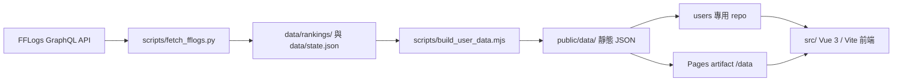

# 系統架構

本專案是靜態化分離架構：Python 負責抓取 FFLogs，Node.js 負責把來源資料建置成網站可讀的統計 JSON，Vue 只負責呈現靜態 JSON。主站共用資料部署在 Pages artifact 的 `/data/`；個人成績單 JSON 另外同步到 users 專用 repo，避免主站 artifact 隨玩家數量無限制膨脹。



## 三層責任邊界

### Data Fetching Layer

`scripts/fetch_fflogs.py` 是唯一可直接呼叫 FFLogs GraphQL API 的資料管線入口，負責：

- OAuth 憑證讀取與多憑證輪替。
- FFLogs 限流、重試、暫時性 500/502/503/504 與逾時處理。
- 淺層 reports 掃描、延遲掃描、歷史補查與既有 report 狀態巡檢。
- 以 `masterData.actors(type: "Player")` 與 `playerDetails` 確認繁中服玩家。
- 寫入 `data/rankings/`、`public/data/rankings/` 與 `data/state.json`。

GraphQL 查詢字串集中在 `scripts/fflogs_pipeline/graphql_queries.py`；這個子模組只描述 FFLogs 欄位需求，不處理限流、掃描游標、資料寫入或 UI 產物格式。`fetch_fflogs.py` 仍是資料權威入口，拆出查詢文本只是降低單檔責任，避免未來調整查詢欄位時誤動掃描策略。

這一層只保存可重建排行榜所需的 report/fight/player 脈絡，不應輸出 UI 專用格式。
`scripts/fetch_honey_b_fans.py` 是例外的趣味資料管線，固定解析 M2S `心醉魂迷：奴役` 衍生紀錄，來源寫入 `data/fun/honey_b_fans.json`，公開輸出寫入 `public/data/fun/honey_b_fans.json`；它不得寫入正式 `data/rankings/` 或 `data/state.json`。

### Data Building Layer

`scripts/build_user_data.mjs` 負責把來源資料整理成前端可直接讀取的靜態 JSON：

- `public/data/users/*.json`
- `public/data/user-entry-details/*.json`
- `public/data/users/index.json`
- `public/data/global_stats.json`
- `public/data/activity.json`
- `public/data/team_rankings.json`
- `public/data/server_compare.json`
- `public/data/ranking-tables/*.json`
- `public/data/ranking-details/*.json`
- `public/data/all/` hidden delta 與額外檢視索引

複雜排序、分位數、隊友統計、職業分布與版本切片應在這一層完成。若新增前端畫面需要新的統計欄位，請先擴充這一層，再讓 Vue 讀取結果。
同名角色若出現在不同伺服器，公開衍生資料會以「角色名稱 + 伺服器」拆成不同玩家；目前不再自動處理轉服合併，也不再把另一個伺服器列為搜尋 alias。
正式 GitHub Actions 會在資料驗證後把 `public/data/users`、`public/data/user-entry-details` 與 hidden 使用者差量同步到 `Final-Fantasy-XIV-Ranking-for-TC-Users`，再於 Pages 建置完成後移除 `dist/data/users`、`dist/data/user-entry-details`、`dist/data/all/users` 與 `dist/data/all/user-entry-details`。這不改變資料建置層的輸出契約，只是部署時把大型個人成績單 JSON 放到專用資料來源。

全域公告是例外的營運靜態內容：`public/data/announcements.json` 直接隨 commit 維護，不從 FFLogs 或使用者統計建置而來；`build_user_data.mjs` 只負責把它同步到 `public/data/all/announcements.json`。這讓公告可快速發佈，同時不碰 append-only 排行榜歷史資料。

### UI Presentation Layer

`src/` 是 Vue 3 / Vite 前端，只能讀取靜態 JSON：

- `src/pages/` 放主要頁面。
- `src/components/` 放跨頁共用元件。
- `src/composables/` 放前端狀態、篩選、排序與資料讀取邏輯。
- `src/composables/rankingApp/` 放 `useRankingApp()` 的拆分子模組：`context.js` 管理 app 注入、`defaults.js` 管理預設值與選項、`useRankingData.js` 管理排行榜列正規化、排序與按需載入細節。
- `src/utils/` 放格式化、分享網址狀態、靜態資料 URL 與 fetch 工具。
- `src/domain/` 放 FFXIV 職業與職能等領域設定。
- `src/styles/app.css` 是樣式入口清單；設計 token、版面骨架、控制項、頁面樣式、表格彈窗與響應式規則分散在同目錄的主題檔，避免所有視覺責任集中在單一 CSS 檔。

前端元件不得直接呼叫 FFLogs API，也不要在 Vue 內重做全服統計或資料聚合。
`src/utils/publicData.js` 集中處理兩個資料基底：排行榜、全服統計、活動資料與公告使用主站 `/data/`；個人成績單索引、主檔與 report 分頁細節預設使用 GitHub raw 的 users 專用 repo，可用 `VITE_USER_DATA_BASE_URL` 覆寫。
公告元件只能讀取 `public/data/announcements.json`，並用瀏覽器 `localStorage` 保存使用者已關閉公告 id；這個狀態不會寫回公開資料。

## 專案結構

```text
.
├── src/
│   ├── App.vue
│   ├── components/
│   ├── composables/
│   │   └── rankingApp/
│   ├── domain/
│   ├── pages/
│   ├── styles/
│   ├── utils/
│   └── main.js
├── scripts/
│   ├── fetch_fflogs.py
│   ├── fflogs_pipeline/
│   ├── fetch_honey_b_fans.py
│   ├── gcd_coverage_core.py
│   ├── backfill_gcd_coverage.py
│   ├── backfill_gcd_coverage_xivanalysis.py
│   ├── build_user_data.mjs
│   ├── validate_data.mjs
│   ├── compact_ranking_data.py
│   ├── compact_state.py
│   └── build_spa_fallback.mjs
├── config/
│   ├── encounters.json
│   ├── fflogs.json
│   └── site.json
├── data/
│   ├── rankings/
│   ├── fun/
│   ├── state.json
│   └── update_status.json
├── public/
│   ├── data/
│   ├── favicon.svg
│   ├── site.webmanifest
│   └── icons/jobs/
├── docs/
└── .github/workflows/update_rankings.yml
```

## 前端頁面範圍

- 排行榜：依副本、伺服器、職業類型、職業、關鍵字與版本篩選成績。
- 全服統計：伺服器分布、職業分布、零式進度概覽與資料狀態。
- 個人成績單：各副本最佳紀錄、歷史紀錄、同職分位、常同場隊友與分享用代表職業。
- 玩家比較：依職能或職業並排比較兩名玩家。
- 隊伍榜：同場 8 人公開紀錄的最速通關、隊伍 rDPS 與成員組成。
- 伺服器對比：收錄玩家、副本通關、職能比例、熱門職業與副本落點。
- 職業分析：各職能與職業的 rDPS 分位、副本分布、伺服器分布與代表紀錄。
- 近期動態：最新公開成績、刷新個人最佳、新收錄玩家、伺服器活躍、副本活躍，以及由 Data Building Layer 預先去重的 Logs / 通關場次趨勢與副本分類占比。圖表上的台服與國際服改版時間標註屬於前端靜態脈絡，不參與資料管線統計。
- Honey B. Lovely 粉絲榜：獨立趣味頁，顯示 M2S 近 7 天 `心醉魂迷：奴役` 粉絲榜、近 7 天報告彈窗、歷史追溯與連續入榜標示，不參與正式排行榜聚合。

## 功能旗標

臨時隱藏或恢復作者相關 UI 標示、社群 / Telegram 連結或 GCD 覆蓋率時，只調整 `src/utils/siteFeatures.js`：

- `顯示作者相關標示`
- `顯示社群連結`
- `顯示Telegram連結`
- `顯示Gcd覆蓋率`

目前 `顯示Gcd覆蓋率=true`，網站會顯示 GCD 欄位。這些旗標只影響前端呈現，不改動公開資料或排行榜歷史資料結構。
